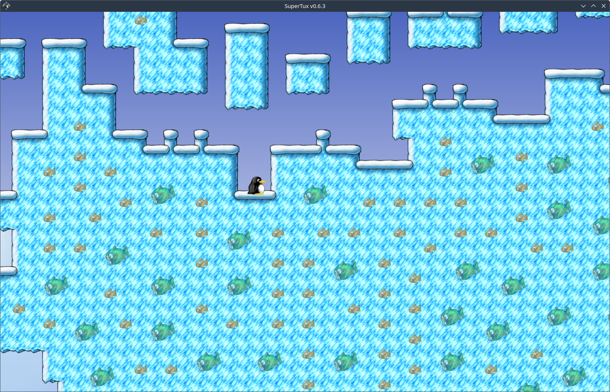

# SuperTux procedural level generator

This is a procedural level generator for SuperTux 2, using the [wave function collapse algorithm](https://github.com/mxgmn/WaveFunctionCollapse). This project is written in [OCaml](https://ocaml.org/).



## How to compile

* Download and install [Opam](https://opam.ocaml.org/) with your distribution's package manager.
* Install the OCaml compiler and [Dune](https://dune.build/) using Opam:

    ```bash
    opam install ocaml
    opam install dune
    ```

* Clone this repository and open a terminal inside the root folder
* Build the project:

    ```bash
    dune build --profile release
    ```

The generated executable (`splg.exe`) is located in the `_build/default` folder.

Note: even though the executable has the `.exe` extension on Linux/MacOS, it is still a native executable.

## How to run

The program expects four parameters:

* The input tilemap file path, which will be used to "teach" the algoritm how to generate a level (`-i`)
* The width of the level to generate, in cells (option `-w`)
* The height of the level to generate, in cells (option `-h`)
* The name/path of the level to generate (option `-o`)

There is an example tilemap in the `example_tilemap` folder of this repository.

Example: creating a 60 (width) x 30 (height) level using the example tilemap:

```bash
./splg.exe -i example_tilemap/tilemap_snow.txt -w 60 -h 30 -o level.stl
```

Then, you can try the level with the `supertux2` command (assuming it is in your PATH):
`supertux2 level.stl`

## How to write a tilemap ?

Use the SuperTux level editor to design your tilemap and then copy the appropriate part of the `tilemap/tiles` section of the SuperTux level file (`.stl`). You can find it using the `Open Level Directory` option of the level editor.
